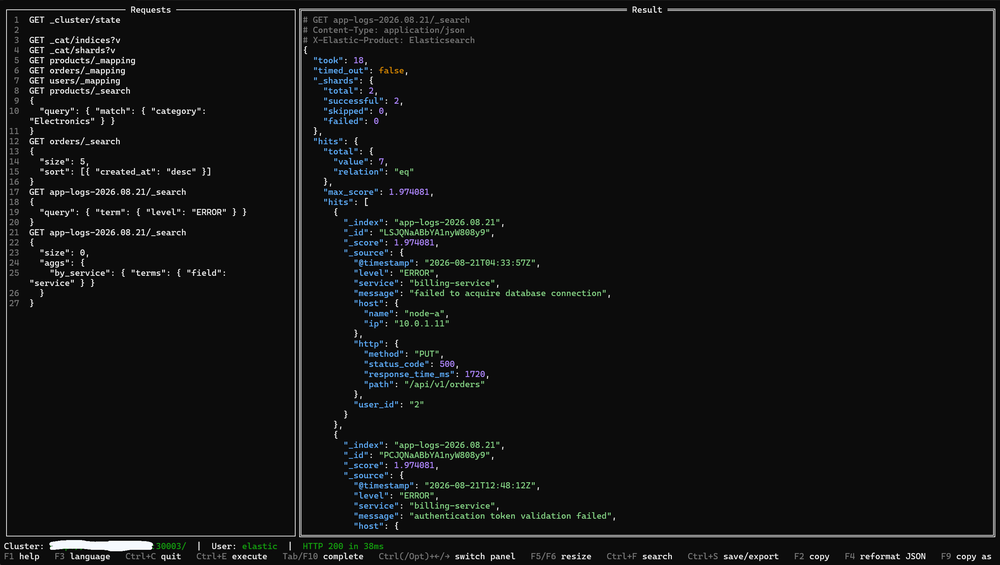
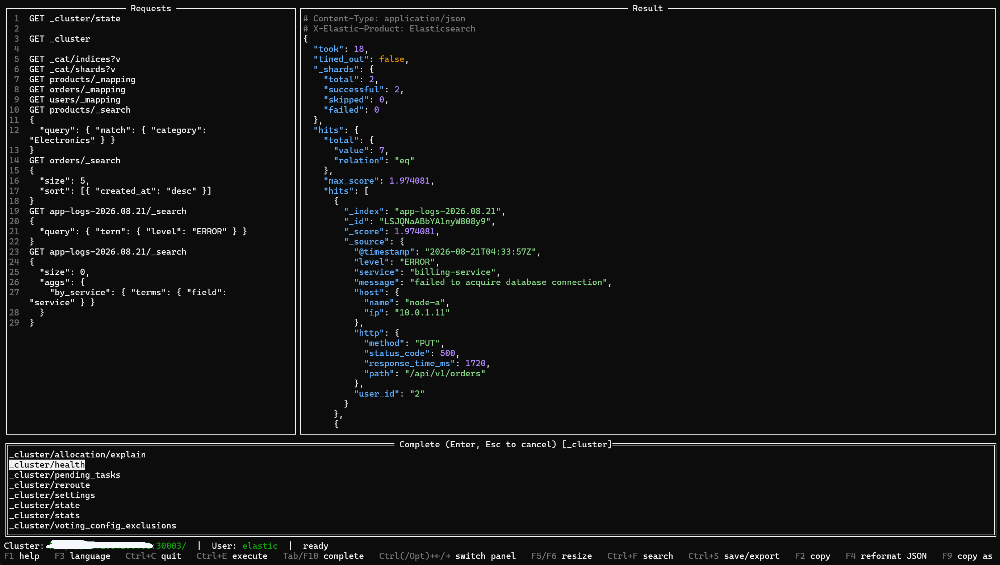
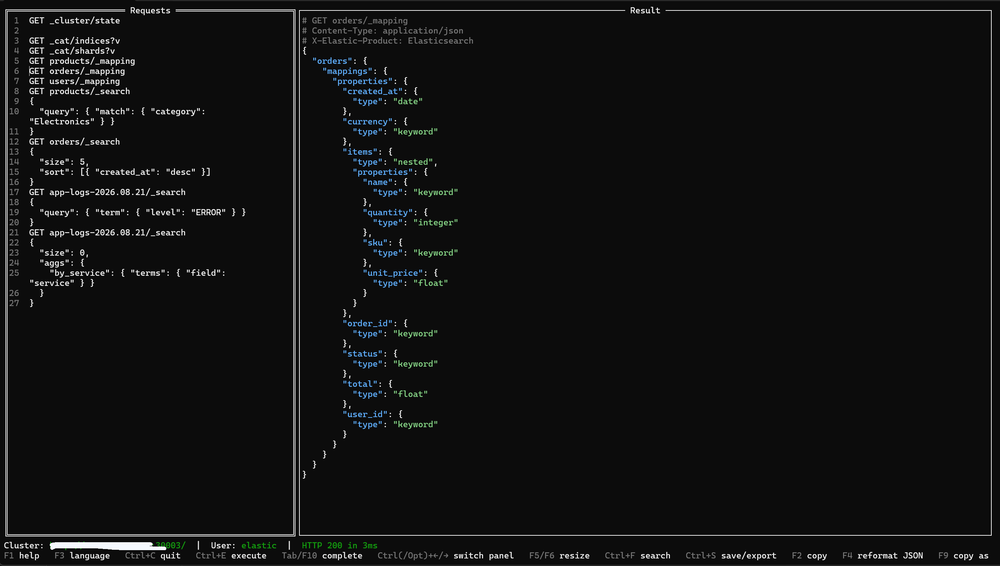
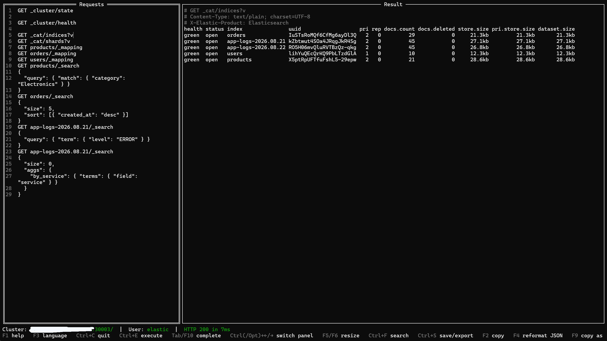

*(Version française : [README_fr.md](README_fr.md))*

# TermDevTools

A terminal-mode simulator of Kibana's **DevTools** view, for querying an Elasticsearch cluster directly from a terminal — Linux (including RHEL 8/9/10), Windows, or macOS — without a browser or a working Kibana.

- [Screenshots](#screenshots)
- [Why](#why)
- [Features](#features)
- [Installation](#installation)
- [Quick start](#quick-start)
- [Configuration](#configuration)
- [Reusable variables](#reusable-variables)
- [Keyboard shortcuts](#keyboard-shortcuts)
- [Security](#security)
- [License](#license)

## Screenshots

<table>
<tr>
<td width="50%"><br><sub>Formatted JSON result of a <code>_search</code> query</sub></td>
<td width="50%"><br><sub>Auto-completion (<code>Tab</code>/<code>F10</code>) on <code>_cluster/...</code></sub></td>
</tr>
<tr>
<td width="50%"><br><sub>Browsing an index's mapping (<code>_mapping</code>)</sub></td>
<td width="50%"><br><sub><code>_cat/indices?v</code> output</sub></td>
</tr>
</table>

## Why

Sometimes an Elasticsearch cluster has no Kibana available, or its Kibana is down — typically during an investigation, which is exactly when you'd need it most. Doing the equivalent by hand with `curl` is possible but tedious (TLS handling, multi-line requests, formatting the JSON response...). TermDevTools reproduces most of the comfort of Kibana's DevTools — a request editor, execute-at-cursor, formatted JSON responses — in a single terminal binary.

## Features

- **Two-panel interface**: request editor (with line numbers and auto-closing `{`/`[`/`"`) on the left (`METHOD endpoint` + optional JSON body), formatted JSON result — request reminder and response headers included — on the right.
- **Execute at cursor** (`Ctrl+Enter`): several requests can coexist in the editor, separated by blank lines; the one under the cursor is executed.
- **Auto-completion** (`Tab`) for endpoints (`_cat/*`, `_cluster/*`, `_nodes/*`, index management, ILM/SLM, snapshots, license...) and, for `_cat/*` commands, for the column names of the `h=`/`s=` parameters. Lists are customizable without recompiling via `endpoints.txt` and `cat_columns.txt`.
- **Reformat the JSON body** under the cursor in place (`F4`) and **copy the request as an equivalent `curl` command** (`F9`, secrets redacted).
- **Reusable `${name}` variables** (`F7` to reload after a hand edit) — see [Reusable variables](#reusable-variables).
- **Search** (`Ctrl+F`) in the editor as well as in the result.
- **Automatic save** of in-progress requests per cluster and per user (on exit and via `Ctrl+S`), reloaded on reconnection.
- **Export** of the displayed result to a timestamped file (`Ctrl+S`, right panel) and **clipboard copy** via OSC 52 (`F2`, works over SSH).
- **Connection**: Basic Auth, API Key, or client certificate (mTLS), with or without TLS verification; history of previously used clusters (never storing a secret there — see [Security](#security)); a certificate picker (`Enter` on the CA/client cert fields) browses the configured directory instead of typing a filename from memory.
- **Built-in help** (`F1`): reminder of shortcuts and file locations.

Full detail of design choices and behavior: [SPEC.md](SPEC.md).

## Installation

### Quick install (recommended)

Requires [Go](https://go.dev/) 1.25 or later. Builds natively for your platform (no cross-compilation) and installs the binary together with its companion files in one self-contained location:

```bash
# Linux / macOS
git clone <repo-url>
cd TermDevTools
./install.sh
```

```powershell
# Windows (PowerShell)
git clone <repo-url>
cd TermDevTools
.\install.ps1
```

Each script:

- builds `termdevtools` for your current OS/architecture;
- copies `cat_columns.txt` and `endpoints.txt` next to it, always refreshed from the repository;
- seeds `cheatsheet.txt` from `cheatsheet.txt.example` **the first time only** — safe to re-run, it never overwrites a cheatsheet you've since customized;
- prints what to add to your `PATH` if the install location isn't on it yet.

Default install location: `~/.local/share/termdevtools` on Linux/macOS (symlinked onto your `PATH` via `~/.local/bin`), `%LOCALAPPDATA%\termdevtools` on Windows. Override it with the `TERMDEVTOOLS_INSTALL_DIR` environment variable (and `TERMDEVTOOLS_BIN_DIR` on Linux/macOS for the symlink location) if you'd rather install somewhere else — e.g. a shared `/opt/termdevtools` for a team.

### Prebuilt binaries

Static binaries are provided for Linux (amd64), Windows (amd64), and macOS (Apple Silicon / arm64) — see the repository's [Releases](../../releases) section, where each binary is bundled in a zip with its companion files (see [Installation layout](#installation-layout) below). No dependency to install: just download and make it executable (`chmod +x` on Linux/macOS).

### Manual build / cross-compiling

To just build without installing, or to cross-compile for a platform other than the one you're on:

```bash
git clone <repo-url>
cd TermDevTools
go build -o termdevtools .
```

The binary is static (`CGO_ENABLED=0`): it needs no system library beyond the base libc, and can be copied as-is onto any RHEL 8/9/10 machine (or any other Linux amd64 distribution), with no installation step.

The [`build-release.sh`](build-release.sh) script cross-compiles all three target platforms (`linux/amd64`, `windows/amd64`, `darwin/arm64`) at once and bundles each binary with its companion files under `dist/<platform>/` — useful for producing binaries to hand out to teammates rather than installing locally.

### Installation layout

Everything below is **optional** except the binary itself — TermDevTools runs with sensible built-in defaults for all of it.

| Location | File | Purpose |
|---|---|---|
| next to the binary | `cheatsheet.txt` | Default editor content on first launch against a given cluster (copy/rename `cheatsheet.txt.example`, or let `install.sh`/`install.ps1` do it). Absent → empty editor. |
| next to the binary | `endpoints.txt` | List of endpoints offered for auto-completion. Absent → falls back to a built-in list. |
| next to the binary | `cat_columns.txt` | `_cat/*` command → columns table, for auto-completion of the `h=`/`s=` parameters. Absent → falls back to a built-in table. |
| `~/.config/termdevtools/config.yaml` | — | **Created automatically** on first successful connection — nothing to set up by hand. See [Configuration](#configuration) below. |

## Quick start

1. **Launch it**: `termdevtools` (`termdevtools.exe` on Windows). The connection screen lists any previously used clusters, plus a **"+ New connection"** option.
2. **Connect**: enter the cluster's URL, pick an authentication type (none, Basic Auth, API Key, or client certificate), and the secret if there is one. Everything except the secret is remembered for next time (see [Configuration](#configuration) below).
3. **Write a request** in the left panel, Kibana Console style — method, endpoint, and an optional JSON body on the following lines:
   ```
   GET _cluster/health
   ```
   Several requests can coexist in the editor, separated by blank lines; the one under the cursor is the one that runs.
4. **Run it**: `Ctrl+E`. The formatted JSON response shows up in the right panel (see the [screenshots](#screenshots) above).
5. From there: `Tab` or `F10` auto-completes an endpoint while typing, `F4` reformats the JSON body under the cursor, `F9` copies the request as an equivalent `curl` command, `Ctrl+S` saves your work for next time. Full reference: [Keyboard shortcuts](#keyboard-shortcuts).

## Configuration

No configuration is needed to get started: a connection screen lets you enter a cluster's URL and credentials directly, and `~/.config/termdevtools/config.yaml` is created automatically on first successful connection. A sample is provided for reference in `config.yaml.example` — **it never contains a secret**: passwords, API key secrets, and passphrases are always re-requested on connection, never written to disk (see [Security](#security)).

The interface language (French by default, or English) is set via `language: fr` / `language: en` in that same `config.yaml` — or switched live from the app with `F3`, which saves the choice for next time.

Mouse support (click to focus a field or select a list entry) is **off by default** — set `mouse: true` in `config.yaml` to enable it. Every mouse interaction has a full keyboard equivalent (see [Keyboard shortcuts](#keyboard-shortcuts)); leaving it off keeps the terminal's own native text selection/copy/paste available, since enabling it captures mouse events for the app instead (`F2` still copies the result either way).

## Reusable variables

Reference a `${name}` placeholder anywhere in a request's URL or JSON body, and it's substituted with a real value just before the request is sent (`Ctrl+E`) or a `curl` command is generated for it (`F9`) — the placeholder itself is what gets saved with your requests, not the resolved value. An undefined variable stops the action with a clear error instead of sending `${name}` to the cluster literally.

Values live in `~/.config/termdevtools/variables_<cluster>.txt` — one per cluster and per user, same scheme as the request save (`Ctrl+S`) — as plain `name=value` lines (`#` for comments). There's no in-app editor for it: open the file directly in your usual text editor, then press `F7` to pick up the change without restarting. The file is created automatically, with an explanatory comment, the first time you connect to a given cluster.

## Keyboard shortcuts

| Action | Key |
|---|---|
| Execute the request under the cursor | `Ctrl+E` [^enter] |
| Switch focus left ↔ right panel | `Ctrl+←` / `Ctrl+→` [^focus] |
| Quit (auto-saves the left panel) | `Ctrl+C` |
| Search in requests / in the result | `Ctrl+F` (depending on focused panel) |
| Resize the left/right split | `F5` / `F6` [^resize] |
| Save (left) / export (right) | `Ctrl+S` (depending on focused panel) |
| Complete an endpoint / a column | `Tab`, `F10`, or `Ctrl+Space` (left panel) [^tab] |
| Reformat (indent) the JSON body under the cursor | `F4` (left panel) |
| Copy the request under the cursor as a `curl` command | `F9` (left panel) — secrets redacted, see [Security](#security) |
| Reload `${name}` variables from disk | `F7` — see [Reusable variables](#reusable-variables) |
| Copy the result to the clipboard | `F2` |
| Switch the interface language (fr/en) | `F3` |
| Help | `F1` (`Esc` to close) |

[^enter]: `Ctrl+Enter` also works on terminals that report it as distinct from plain `Enter` — many don't, which is why `Ctrl+E` is the primary, always-reliable shortcut.
[^focus]: On macOS, `Option`/`Alt` also works instead of `Ctrl` — `Ctrl+←/→` is intercepted by the system by default (Mission Control desktop switching).
[^resize]: `Ctrl+Shift+←/→` (`Option`/`Alt` included, on macOS) also works on terminals that report it distinctly from an unmodified arrow key — not all do, which is why `F5`/`F6` are the primary, always-reliable shortcuts.
[^tab]: On some terminals (notably PuTTY) `Tab` is swallowed entirely — no key event reaches the app at all. `F10` is a guaranteed-reliable alternative. **PuTTY is generally discouraged**: no issues on native macOS/Windows 10+ terminals.

## Security

- **TLS verified by default**: server certificate verification is enabled unless explicitly disabled when connecting.
- **No secret ever persisted**: password, API Key secret, and private key passphrase are never written to `config.yaml` — only the URL, auth type, and non-sensitive identifiers (username, API key ID, certificate paths) are, with restricted permissions (`0600` for files, `0700` for directories).
- **Clipboard copy (`F2`)** via OSC 52: the local terminal receives the data to copy without it ever passing through a server-side clipboard — but this mechanism gives no guarantee of success (depends on the terminal in use).
- The project went through a security review (code review, no execution of external commands, `govulncheck` with no known exploitable vulnerability) before publication — see also the [disclaimer](#disclaimer--limitation-of-liability) below.

## License

This project is distributed under the **[GNU Affero General Public License v3.0](LICENSE)** (AGPLv3): you're free to use, study, modify, and redistribute it, provided the source code (including your modifications) remains available under the same terms — including when the tool is exposed over a network (service mode usage).

> **Note of intent (not legally binding)**: the spirit of this project is to remain a community tool, improved collectively, not a product resold as-is. The AGPLv3 does not formally forbid commercial use — only a non-commercial license would, at the cost of heavier and less "open source" restrictions — but that's the use its author hopes to see made of it.

## Disclaimer / limitation of liability

TermDevTools is published **as is**, without warranty of any kind, express or implied — including, without limitation, the warranties of merchantability, fitness for a particular purpose, and non-infringement (see sections 15 through 17 of the [AGPLv3 license](LICENSE), which govern).

In particular:

- This project is developed and maintained **on its author's free time**, with no commitment to availability, maintenance, security patches, or future evolution.
- The author and contributors **decline any responsibility** for the direct or indirect consequences of using this tool — including, without limitation, data loss, service interruption, or any action executed against an Elasticsearch cluster through this tool (TermDevTools executes requests exactly as you write them, with no confirmation beyond what is described in [SPEC.md](SPEC.md)).
- Using this tool against a production cluster remains **the sole responsibility of the person using it**: always review your requests, particularly destructive operations (`DELETE`, mapping updates, etc.), just as you would with any Elasticsearch client (Kibana, `curl`, or otherwise).
- Future evolutions of the project (or the lack thereof) are the responsibility only of whoever makes them, at the time they are made.
