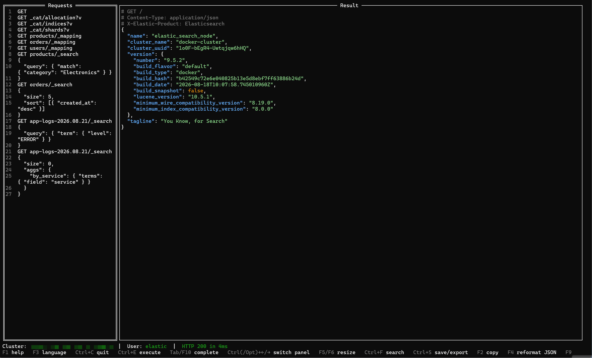

*(English version: [README.md](README.md))*

# TermDevTools

Simulateur en mode terminal de la vue **DevTools** de Kibana, pour interroger un cluster Elasticsearch ou OpenSearch directement depuis un terminal — Linux (dont RHEL 8/9/10), Windows ou macOS — sans navigateur ni Kibana fonctionnel. Un seul binaire, rien d'autre à installer.

> [!IMPORTANT]
> **Nouveautés de la 0.6 (bêta)**
>
> - **Catalogue de recettes (`F8`)** — une centaine de requêtes prêtes à l'emploi pour les investigations courantes : santé du cluster, shards non assignés, disque, nœuds, tâches, snapshots, cycle de vie des index, montées de version.
> - **Elasticsearch et OpenSearch, selon la version** — la distribution et la version sont détectées à la connexion (Elasticsearch 7.17 à 9.x, OpenSearch 2.x et 3.x) ; seuls les recettes et endpoints qui existent sur ce cluster sont proposés.
> - **Un seul fichier à installer** — recettes, endpoints et colonnes `_cat` sont intégrés au binaire ; les releases sont accompagnées de leurs sommes SHA-256.
> - **Vos propres recettes et endpoints** — de simples fichiers texte, ajoutés à ceux du binaire et rechargés avec `F7`.
> - **Plus sûr** — redirections HTTP jamais suivies, identifiants refusés dans l'URL, sauvegardes atomiques, `Ctrl+C` qui sauvegarde toujours avant de quitter, clés client chiffrées PKCS#8 acceptées.
>
> C'est une **version bêta** : vérifiée sur onze clusters réels, pas encore par d'autres utilisateurs que son auteur. Détail, points à connaître avant de mettre à jour depuis la 0.5 et limites connues : **[journal des versions](CHANGELOG_fr.md)**.

- [Démo](#démo)
- [Pourquoi](#pourquoi)
- [Fonctionnalités](#fonctionnalités)
- [Installation](#installation)
- [Démarrage rapide](#démarrage-rapide)
- [Configuration](#configuration)
- [Recettes et données de référence](#recettes-et-données-de-référence)
- [Variables réutilisables](#variables-réutilisables)
- [Raccourcis clavier](#raccourcis-clavier)
- [Sécurité](#sécurité)
- [Licence](#licence)

Autres documents : [guide d'installation et de paramétrage](INSTALL_fr.md) · [journal des versions](CHANGELOG_fr.md) · [spécification](SPEC_fr.md).

## Démo

<p align="center"></p>

*Animation enregistrée avec la version 0.5 : le catalogue de recettes (`F8`) n'y figure pas.*

## Pourquoi

Il arrive qu'un cluster Elasticsearch n'ait pas de Kibana disponible, ou que son Kibana soit hors service — typiquement pendant une investigation où c'est justement le moment où on en aurait le plus besoin. Faire l'équivalent en `curl` à la main est possible mais pénible (gestion du TLS, requêtes multi-lignes, mise en forme du JSON de réponse...). TermDevTools reproduit l'essentiel du confort des DevTools de Kibana — éditeur de requêtes, exécution au curseur, réponse JSON formatée — dans un simple binaire terminal.

## Fonctionnalités

- **Interface en deux panneaux** : éditeur de requêtes (avec numéros de ligne et auto-fermeture des `{`/`[`/`"`) à gauche (`MÉTHODE endpoint` + corps JSON optionnel), résultat JSON formaté — rappel de la requête et en-têtes de réponse inclus — à droite.
- **Exécution au curseur** (`Ctrl+E`) : plusieurs requêtes peuvent cohabiter dans l'éditeur, séparées par des lignes vides ; celle sous le curseur est exécutée.
- **Catalogue de recettes** (`F8`) : une centaine de requêtes prêtes à l'emploi pour les investigations courantes — santé du cluster, shards non assignés, disque, nœuds, tâches, snapshots, cycle de vie des index, montées de version — filtrées à la frappe, prévisualisées, insérées dans l'éditeur avec `Entrée`. Ajoutez les vôtres ; voir [Recettes et données de référence](#recettes-et-données-de-référence).
- **S'adapte au cluster** : la distribution et la version sont détectées à la connexion — Elasticsearch 7.17 à 9.x, OpenSearch 2.x et 3.x — et seuls les recettes et endpoints qui existent sur ce cluster sont proposés.
- **Auto-complétion** (`Tab`) des endpoints (`_cat/*`, `_cluster/*`, `_nodes/*`, gestion d'index, ILM/SLM ou ISM, snapshots, ingest, licence...) et, pour les commandes `_cat/*`, des noms de colonnes des paramètres `h=`/`s=` — demandés au cluster lui-même, donc exacts quelle que soit sa version.
- **Reformater le JSON** du corps sous le curseur sur place (`F4`) et **copier la requête en commande `curl`** équivalente (`F9`, secrets masqués).
- **Variables réutilisables `${nom}`** — voir [Variables réutilisables](#variables-réutilisables).
- **Rien d'autre que le binaire** : recettes, endpoints et colonnes `_cat` y sont intégrés. Vos ajouts sont de simples fichiers texte, rechargés avec `F7`.
- **Recherche** (`Ctrl+F`) dans l'éditeur comme dans le résultat.
- **Sauvegarde automatique** des requêtes en cours par cluster et par utilisateur (à la fermeture et via `Ctrl+S`), rechargées à la reconnexion.
- **Export** du résultat affiché vers un fichier horodaté (`Ctrl+S`, panneau droit) et **copie presse-papier** via OSC 52 (`F2`, fonctionne à travers SSH).
- **Connexion** : Basic Auth, API Key ou certificat client (mTLS, clé chiffrée ou non), avec ou sans vérification TLS, à travers un proxy HTTP ou SOCKS5 s'il en faut un (voir [Configuration](#configuration)) ; historique des clusters déjà utilisés (sans jamais y stocker de secret — voir [Sécurité](#sécurité)) ; un sélecteur de certificat (`Entrée` sur les champs CA/certificat client) parcourt le dossier configuré plutôt que de taper un nom de fichier de mémoire.
- **Aide intégrée** (`F1`) : rappel des raccourcis et de l'emplacement des fichiers.

Détail complet des choix et du comportement : [SPEC_fr.md](SPEC_fr.md).

## Installation

Le **[guide d'installation et de paramétrage](INSTALL_fr.md)** détaille chaque étape, plateforme par plateforme, jusqu'à la première requête. En résumé :

### Binaires précompilés (recommandé)

Un fichier par plateforme, et rien d'autre, sur la page [Releases](https://github.com/gnocent/termdevtools/releases) :

| Plateforme | Fichier |
|---|---|
| Linux (x86-64) | `termdevtools-linux-amd64` |
| Windows (x86-64) | `termdevtools-windows-amd64.exe` |
| macOS (Apple Silicon) | `termdevtools-darwin-arm64` |

Sous Linux, par exemple :

```bash
sha256sum -c SHA256SUMS --ignore-missing     # vérifie le fichier téléchargé
chmod +x termdevtools-linux-amd64
mv termdevtools-linux-amd64 ~/.local/bin/termdevtools
termdevtools --version
```

Le binaire est statique : il n'a besoin d'aucune bibliothèque système et se copie tel quel sur une autre machine, y compris sans accès à Internet. Les binaires ne sont pas signés ; macOS et Windows peuvent le signaler au premier lancement (voir le [guide](INSTALL_fr.md#2-installer-le-binaire)).

### Depuis les sources

Nécessite [Go](https://go.dev/) 1.25 ou supérieur.

```bash
# Linux / macOS
git clone https://github.com/gnocent/termdevtools.git
cd termdevtools
./install.sh
```

```powershell
# Windows (PowerShell)
git clone https://github.com/gnocent/termdevtools.git
cd termdevtools
.\install.ps1
```

Chaque script :

- compile `termdevtools` pour votre OS/architecture courants — le binaire est tout ce qu'il y a à installer ;
- indique quoi ajouter à votre `PATH` si l'emplacement d'installation n'y est pas encore ;
- signale, sans y toucher, les fichiers annexes qu'une version antérieure (jusqu'à la 0.5) a pu laisser à côté du binaire (voir [Mise à jour depuis la 0.5](#mise-à-jour-depuis-la-05)).

Emplacement par défaut : `~/.local/share/termdevtools` sous Linux/macOS (lié via un symlink dans `~/.local/bin`), `%LOCALAPPDATA%\termdevtools` sous Windows. Personnalisable via la variable d'environnement `TERMDEVTOOLS_INSTALL_DIR` (et `TERMDEVTOOLS_BIN_DIR` sous Linux/macOS pour l'emplacement du symlink) — par exemple pour une installation partagée dans `/opt/termdevtools`.

Pour compiler sans installer : `go build -o termdevtools .`

Le script [`build-release.sh`](build-release.sh) produit dans `dist/` les trois binaires publiés et leur fichier `SHA256SUMS`, en y inscrivant la version (`./build-release.sh v0.6`, ou sans argument ce que `git describe` dit du dépôt) — celle que `termdevtools --version` affiche.

### Arborescence d'installation

Seul le binaire est nécessaire. Tous les fichiers ci-dessous sont **facultatifs**, ou créés par le programme lui-même.

| Emplacement | Fichier | Rôle |
|---|---|---|
| `~/.config/termdevtools/` | `config.yaml` | **Créé automatiquement** — rien à préparer à la main. Voir [Configuration](#configuration) ci-dessous. |
| `~/.config/termdevtools/` | `queries_<cluster>.txt` | Vos requêtes pour chaque cluster, sauvegardées par `Ctrl+S` et à la fermeture. |
| `~/.config/termdevtools/` | `variables_<cluster>.txt` | Vos variables `${nom}` pour chaque cluster — voir [Variables réutilisables](#variables-réutilisables). |
| `~/.config/termdevtools/` | `recipes/*.txt`, `endpoints.txt` | Vos propres recettes et endpoints, ajoutés à ceux du binaire — voir [Recettes et données de référence](#recettes-et-données-de-référence). |
| `~/.config/termdevtools/` | `exports/` | Résultats exportés avec `Ctrl+S` depuis le panneau droit. Jusqu'à la 0.6, ce dossier se trouvait à côté du binaire. |
| à côté du binaire | `recipes/*.txt`, `endpoints.txt` | Idem, partagés par tous les utilisateurs de cette installation. |
| à côté du binaire | `cheatsheet.txt` | Contenu de départ de l'éditeur propre à cette installation, à la place de celui du binaire. |

Sous Windows, `~` désigne `%USERPROFILE%`. Le programme n'écrit rien à côté du binaire : son dossier peut être en lecture seule.

### Mise à jour depuis la 0.5

Les versions jusqu'à la 0.5 étaient livrées avec trois fichiers à côté du binaire. Une fois le binaire remplacé :

- `cat_columns.txt` n'est plus lu (les colonnes sont demandées au cluster) : supprimez-le.
- `endpoints.txt` est toujours lu, mais comme des *ajouts* à la liste intégrée et non plus un remplacement. Sauf si vous y aviez ajouté vos propres endpoints, supprimez-le — la liste intégrée est plus complète et tient compte de la version du cluster.
- `cheatsheet.txt` fournit toujours le contenu de départ de l'éditeur pour un cluster auquel on se connecte pour la première fois. Supprimez-le pour obtenir celui du binaire ; ses requêtes se trouvent désormais dans le catalogue de recettes (`F8`).

L'interface démarre désormais en anglais tant qu'aucune langue n'a été choisie : `F3` repasse au français et retient ce choix. Les autres changements de comportement (redirections, identifiants dans l'URL, `F7`) sont listés dans le [journal des versions](CHANGELOG_fr.md).

## Démarrage rapide

1. **Lancer l'outil** : `termdevtools` (`termdevtools.exe` sous Windows). L'écran de connexion liste les clusters déjà utilisés, plus une option **« + New connection »**. L'interface démarre en anglais : une fois connecté, `F3` la passe en français et retient ce choix.
2. **Se connecter** : saisir l'URL du cluster, choisir un type d'authentification (aucune, Basic Auth, API Key, ou certificat client), puis le secret s'il y en a un. Tout est mémorisé pour la prochaine fois, sauf le secret (voir [Configuration](#configuration) ci-dessous).
3. **Écrire une requête** dans le panneau de gauche, façon Kibana Console — méthode, endpoint, puis un corps JSON optionnel sur les lignes suivantes :
   ```
   GET _cluster/health
   ```
   Plusieurs requêtes peuvent cohabiter dans l'éditeur, séparées par des lignes vides ; celle sous le curseur est celle qui s'exécute. À la première connexion à un cluster, l'éditeur contient déjà quelques requêtes valables partout.
4. **L'exécuter** : `Ctrl+E`. Le résultat JSON formaté apparaît dans le panneau de droite (voir la [démo](#démo) ci-dessus).
5. **Ou choisir une recette** : `F8` ouvre le catalogue. Tapez quelques mots (`unassigned`, `disk`, `snapshot`... — les recettes sont en anglais), déplacez-vous avec les flèches, `Entrée` insère la recette à la fin de l'éditeur, curseur sur sa requête — `Ctrl+E` l'exécute.
6. Ensuite : `Tab` ou `F10` complète un endpoint en cours de frappe, `F4` reformate le corps JSON sous le curseur, `F9` copie la requête en commande `curl` équivalente, `Ctrl+S` sauvegarde le travail en cours. Référence complète : [Raccourcis clavier](#raccourcis-clavier).

La version pas à pas, champ par champ, avec la création d'une clé d'API et les formats de certificat acceptés : [guide, §3](INSTALL_fr.md#3-première-connexion).

## Configuration

Aucune configuration n'est nécessaire pour démarrer : un écran de connexion permet de saisir directement l'URL et les identifiants d'un cluster, et `~/.config/termdevtools/config.yaml` est créé automatiquement, chaque paramètre documenté sur place. Un exemple est fourni à titre indicatif dans `config.yaml.example` — **il ne contient jamais de secret** : mots de passe, clés d'API et passphrases sont redemandés à chaque connexion, jamais écrits sur disque (voir [Sécurité](#sécurité)). Chaque paramètre est décrit dans le [guide, §5](INSTALL_fr.md#5-réglages--configyaml).

La distribution et la version du cluster sont détectées à chaque connexion et affichées dans la barre de statut (`ES 9.5.4`, `OS 2.19.6`). Quand elles ne peuvent pas l'être — un proxy qui masque la réponse du cluster, ou un OpenSearch en mode compatibilité, qui annonce une fausse version — tout ce qui pourrait s'appliquer est proposé plutôt que masqué ; `distribution:` et `version:` sur l'entrée du cluster dans `config.yaml` permettent alors de les indiquer vous-même.

**Proxy.** Un cluster est joint à travers le proxy que désignent les variables d'environnement `HTTPS_PROXY` / `HTTP_PROXY`, sauf si `NO_PROXY` l'exclut ; `localhost` n'y passe jamais. Pour un cluster en particulier, `proxy:` sur son entrée dans `config.yaml` l'emporte : `proxy: http://proxy.example.com:3128`, `proxy: socks5://127.0.0.1:1080` (ce qu'ouvre `ssh -D 1080 bastion`), ou `proxy: none` pour une connexion directe. Le proxy utilisé est toujours affiché, à la connexion et en cas d'échec. Détails et limites dans le [guide, §5](INSTALL_fr.md#5-réglages--configyaml).

La langue de l'interface (anglais par défaut, ou français) se règle via `language: en` / `language: fr` dans ce même `config.yaml` — ou se change à la volée dans l'appli avec `F3`, qui enregistre le choix pour la prochaine fois.

Le support de la souris (cliquer pour donner le focus à un champ ou sélectionner une entrée de liste) est **désactivé par défaut** — mettre `mouse: true` dans `config.yaml` pour l'activer. Toute interaction souris a un équivalent clavier complet (voir [Raccourcis clavier](#raccourcis-clavier)) ; le laisser désactivé garde la sélection/collage natifs du terminal disponibles, puisque l'activer capte les événements souris pour l'appli à la place (`F2` copie toujours le résultat, avec ou sans souris).

## Recettes et données de référence

Tout ce que TermDevTools suggère — les recettes du catalogue (`F8`), les endpoints et les colonnes `_cat` de l'auto-complétion — est intégré au binaire, chaque entrée étant marquée des clusters auxquels elle s'applique. Une fois connecté, vous ne voyez que ce qui fonctionne sur ce cluster : un Elasticsearch 8 reçoit les recettes ILM, un OpenSearch 2 les recettes ISM. Les recettes sont rédigées en anglais.

**Ajouter les vôtres.** Vos recettes vont dans `~/.config/termdevtools/recipes/`, en simples fichiers texte ; un modèle commenté, `my-recipes.txt`, y est créé au premier lancement. Un fichier de recettes s'écrit comme le contenu de l'éditeur, avec quelques directives en commentaire :

```
# @group Snapshots
# @recipe Snapshots nocturnes
# @tags backup
# Affiché dans l'aperçu du catalogue.
GET _snapshot/nightly/_all
```

- `@group` range les recettes sous un thème — un thème existant les place avec les recettes intégrées de ce thème.
- `@recipe` démarre une recette. Avec le groupe et le titre d'une recette intégrée, elle la remplace.
- `@tags` ajoute des mots que le filtre reconnaîtra.
- `@es >=8.7` ou `@opensearch >=2.4 <3.0` réserve une recette à certains clusters (partout, sans eux).

Vos recettes s'*ajoutent* à celles du binaire, elles ne remplacent jamais le catalogue entier, et sont signalées comme les vôtres dans la liste. `~/.config/termdevtools/endpoints.txt` (un endpoint par ligne, mêmes marques facultatives) étend l'auto-complétion de la même façon. Un dossier `recipes/` et un `endpoints.txt` à côté du binaire font de même pour tous ceux qui partagent cette installation. Après modification de l'un d'eux, `F7` recharge sans redémarrer ; une erreur dans un fichier est signalée dans la barre de statut, avec le fichier et la ligne.

**Lire ce qui est intégré.** `termdevtools --export-defaults <dossier>` écrit les recettes et endpoints intégrés sous forme de fichiers — pour les lire, ou comme point de départ pour les vôtres. Il n'écrase jamais un fichier existant, et refuse les deux dossiers ci-dessus : exportées là, les recettes intégrées seraient relues comme les vôtres et masqueraient celles des versions suivantes.

**Suivre les nouvelles versions.** Les données intégrées couvrent les versions connues à la compilation du binaire ; un cluster plus récent reçoit ce qui valait pour la dernière version connue. Les colonnes `_cat` n'en dépendent pas du tout : elles sont demandées au cluster.

## Variables réutilisables

Référencez un placeholder `${nom}` n'importe où dans l'URL ou le corps JSON d'une requête : il est substitué par une vraie valeur juste avant l'envoi de la requête (`Ctrl+E`) ou la génération d'une commande `curl` (`F9`) — c'est le placeholder lui-même qui est sauvegardé avec vos requêtes, pas la valeur résolue. Une variable non définie bloque l'action avec une erreur claire plutôt que d'envoyer `${nom}` tel quel au cluster.

Les valeurs vivent dans `~/.config/termdevtools/variables_<cluster>.txt` — un fichier par cluster et par utilisateur, même principe que la sauvegarde des requêtes (`Ctrl+S`), au format `nom=valeur` (une par ligne, `#` pour les commentaires). Pas d'éditeur intégré pour ça : ouvrez le fichier directement dans votre éditeur de texte habituel, puis appuyez sur `F7` pour prendre en compte le changement sans redémarrer. Le fichier est créé automatiquement, avec un commentaire explicatif, à la première connexion à un cluster donné.

## Raccourcis clavier

| Action | Touche |
|---|---|
| Exécuter la requête sous le curseur | `Ctrl+E` [^entree] |
| Basculer focus panneau gauche ↔ droit | `Ctrl+←` / `Ctrl+→` [^focus] |
| Quitter (sauvegarde automatique du panneau gauche) | `Ctrl+C` |
| Rechercher dans les requêtes / dans le résultat | `Ctrl+F` (selon le panneau focus) |
| Redimensionner le split gauche/droite | `F5` / `F6` [^redim] |
| Sauvegarder (gauche) / exporter (droite) | `Ctrl+S` (selon le panneau focus) |
| Ouvrir le catalogue de recettes | `F8` — taper pour filtrer, flèches pour se déplacer, `Entrée` pour insérer, `Echap` pour fermer |
| Compléter un endpoint / une colonne | `Tab`, `F10` ou `Ctrl+Espace` (panneau gauche) [^tab] |
| Reformater (indenter) le JSON sous le curseur | `F4` (panneau gauche) |
| Copier la requête sous le curseur en commande `curl` | `F9` (panneau gauche) — secrets masqués, voir [Sécurité](#sécurité) |
| Recharger vos fichiers édités à la main (variables, recettes, endpoints) | `F7` — voir [Recettes et données de référence](#recettes-et-données-de-référence) |
| Copier le résultat dans le presse-papier | `F2` |
| Changer la langue de l'interface (fr/en) | `F3` |
| Aide | `F1` (`Echap` pour fermer) |

[^entree]: `Ctrl+Entrée` fonctionne aussi sur les terminaux qui le rapportent distinctement d'un simple `Entrée` — beaucoup ne le font pas, d'où `Ctrl+E` comme raccourci principal, toujours fiable.
[^focus]: Sur macOS, `Option`/`Alt` fonctionne aussi à la place de `Ctrl` — `Ctrl+←/→` est intercepté par le système par défaut (changement d'espace Mission Control).
[^redim]: `Ctrl+Maj+←/→` (`Option`/`Alt` inclus, sur macOS) fonctionne aussi sur les terminaux qui le rapportent distinctement d'une flèche non modifiée — tous ne le font pas, d'où `F5`/`F6` comme raccourcis principaux, toujours fiables.
[^tab]: Sur certains terminaux (notamment PuTTY), `Tab` est absorbé entièrement — aucun événement clavier n'atteint l'appli. `F10` est une alternative garantie fiable. **PuTTY est globalement déconseillé** : aucun souci sous macOS/Windows 10+ natifs.

## Sécurité

**Ce que le programme fait, et ne fait pas**

- **Il ne parle qu'au cluster que vous avez choisi** — à travers un proxy seulement si votre environnement ou `config.yaml` en désigne un, et en l'affichant. Aucune télémétrie, aucune recherche de mise à jour, aucune commande externe exécutée.
- **Aucun secret n'est écrit sur le disque** : mot de passe, secret d'API Key et passphrase de clé privée sont redemandés à chaque connexion. Seuls l'URL, le type d'authentification et les identifiants non sensibles (nom d'utilisateur, identifiant de clé d'API, chemins de certificats) sont enregistrés dans `config.yaml`.
- **Une URL contenant des identifiants est refusée** (`https://utilisateur:motdepasse@hôte`) : enregistrée et affichée, elle aurait exposé le mot de passe.
- **TLS vérifié par défaut**, TLS 1.2 au minimum ; la vérification du certificat serveur ne se désactive qu'explicitement, connexion par connexion.
- **Les redirections HTTP ne sont jamais suivies** : vos identifiants ne partent pas vers une autre adresse que celle saisie, et une requête n'est pas rejouée ailleurs. Une redirection est affichée telle quelle.
- **Rien de ce qui est affiché n'est interprété par le terminal** : les caractères de contrôle d'une réponse du cluster, d'un fichier ou d'un message d'erreur n'atteignent jamais l'écran.
- **Fichiers à vous seul** : permissions `0600` pour les fichiers et `0700` pour les dossiers (sous Linux et macOS), écritures atomiques — une coupure pendant une sauvegarde ne détruit pas le contenu précédent.
- **`F9` (copie en `curl`)** n'inclut jamais les secrets : ils sont remplacés par un rappel à compléter.
- **`F2` (presse-papier)** passe par OSC 52 : la donnée va au terminal local, sans presse-papier côté serveur — mais ce mécanisme ne confirme pas le succès de la copie.

**Ce à quoi le programme fait confiance**

- **Le dossier du binaire et votre dossier de configuration.** Les recettes, endpoints et contenu de départ qui s'y trouvent sont proposés à l'utilisateur : dans une installation partagée, le dossier du binaire ne doit être modifiable que par des personnes de confiance. Un fichier de recettes ou d'endpoints contenant des caractères de contrôle est refusé.
- **Le proxy, quand il y en a un.** Pour un cluster en https, il ne voit que l'adresse demandée : le chiffrement et la vérification du certificat se font de bout en bout. Pour un cluster en http, il voit tout, identifiants compris. Ses propres identifiants ne se donnent que par la variable d'environnement ; ils ne sont ni enregistrés, ni affichés, ni envoyés au cluster. Un proxy joint en TLS (`https://`) est refusé.
- **Vous.** Une requête est envoyée telle qu'elle est écrite, sans confirmation — `DELETE` compris.

**Ce qui a été vérifié, et ce qui ne l'a pas été**

- Relecture de sécurité du code et tests automatisés pour chacun des points ci-dessus ; `govulncheck` ne signale aucune vulnérabilité connue dans les dépendances.
- Chaque requête de chaque recette a été exécutée sur onze clusters réels (Elasticsearch 7.17 à 9.5, OpenSearch 2.0 à 3.9).
- **Aucun audit externe indépendant n'a été réalisé**, et les binaires ne sont pas signés : vérifiez leur somme SHA-256. Voir aussi l'[avertissement](#avertissement--limitation-de-responsabilité) ci-dessous.

## Licence

Ce projet est distribué sous licence **[GNU Affero General Public License v3.0](LICENSE)** (AGPLv3) : vous êtes libre de l'utiliser, l'étudier, le modifier et le redistribuer, à condition que le code source (y compris vos modifications) reste disponible dans les mêmes termes — y compris si l'outil est exposé via un réseau (usage en mode service).

> **Note d'intention (non contraignante juridiquement)** : l'esprit de ce projet est de rester un outil communautaire et amélioré collectivement, pas un produit revendu tel quel. L'AGPLv3 n'interdit pas formellement un usage commercial — seule une licence non-commerciale le ferait, au prix de restrictions plus lourdes et moins "open source" — mais c'est l'usage que son auteur espère en voir fait.

## Avertissement / limitation de responsabilité

TermDevTools est un outil publié **tel quel** ("as is"), sans garantie d'aucune sorte, explicite ou implicite — y compris, sans s'y limiter, les garanties de qualité marchande, d'adéquation à un usage particulier et d'absence de contrefaçon (voir les articles 15 à 17 de la [licence AGPLv3](LICENSE), qui font foi).

En particulier :

- Ce projet est développé et maintenu **sur le temps libre de son auteur**, sans engagement de disponibilité, de maintenance, de correctif de sécurité ou d'évolution future.
- L'auteur et les contributeurs **déclinent toute responsabilité** pour les conséquences directes ou indirectes de l'utilisation de cet outil — y compris, sans s'y limiter, une perte de données, une interruption de service, ou toute action exécutée sur un cluster Elasticsearch ou OpenSearch via cet outil (TermDevTools exécute les requêtes telles que vous les écrivez, sans confirmation supplémentaire au-delà de ce qui est décrit dans [SPEC_fr.md](SPEC_fr.md)).
- L'utilisation de cet outil contre un cluster de production reste **sous l'entière responsabilité de la personne qui l'utilise** : vérifiez toujours vos requêtes, en particulier les opérations destructrices (`DELETE`, mises à jour de mapping, etc.), comme vous le feriez avec n'importe quel client Elasticsearch (Kibana, `curl`, ou autre).
- Les évolutions futures du projet (ou leur absence) n'engagent que leurs auteurs respectifs au moment où elles sont apportées.
